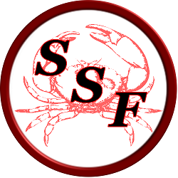

# SAFE SEAFOOD COIN

The Home of Blockchain Tracking, Storing and Retrieving Shellfish and Seafood Harvest Tag information for The Restaurant, Hospitality and Global Aquaculture Industries.
=====================================================================================================================================

Safe SeaFood ($SSF) coin's aim is to improve the existing ways in which global aquaculture, the hospitality industry and restaurants store the harvest and shipping information contained on industry standard Shellfish and Seafood Harvest Tags by incorporating that information into the Safe SeaFood blockchain so local, state and federal regulators can track and retrieve that information in a secure, indisputable, tamper resistant, verifiable way using blockchain technology.

WEBSITE - www.safeseafoodcoin.com

EXPLORER - http://pacific.safeseafoodcoin.com

Ticker: SSF

Algo: Scrypt

Minimum Transaction .05 $SSF

Minimum Transaction Fee - .02 $SSF

Network port: 34128

RPC port: 43128

Pre-mine for Development Funding/Promotions - 2,000,000*

POW STATS
================

POW Block Reward - 10 $SSF

Confirmation Maturity - 30 Blocks

Block Target Time - 300 Sec

POS STATS
==============

POS Block Reward - 1-3%

Confirmation Maturity - 30 Blocks

Block Target Time - 300 Sec

Downloads
===============

SOURCE - github.com/SafeSeafoodCoin/SafeSeafood

WALLET- Windows - github.com/SafeSeafoodCoin/Wallets

WALLET - Linux - github.com/SafeSeafoodCoin/Wallets

WALLET - Mac - Coming Soon

ANDROID - Coming Soon

IOS - Coming Soon

Contact Us
===============

https://discord.gg/2VPGw5j

www.crypto-city.com/index.php/ssfcoin/

www.twitter.com/SSFcoin

www.t.me/ssfcoin

www.facebook.com/SSFcoin

www.instagram.com/safeseafood_coin/

www.medium.com/@safeseafoodcoin

Development process
===========================

Developers work in their own trees, then submit pull requests when they think their feature or bug fix is ready. The patch will be accepted if there is broad consensus that it is a good thing.

License
=========

Safe Seafood Coin is released under the terms of the MIT license. See `LICENSE` for more
information or see http://opensource.org/licenses/MIT.

Steemit - Prochef.Bill
 

